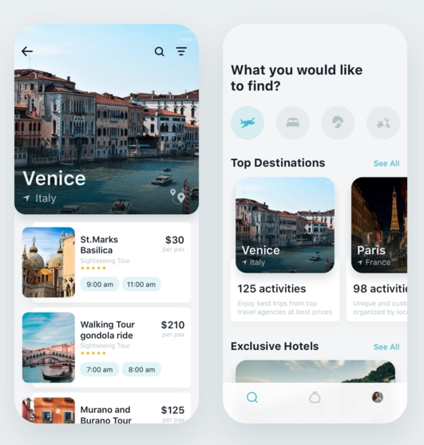

# Travel_UI
<!--
*** Thanks for checking out this README Template. If you have a suggestion that would
*** make this better, please fork the repo and create a pull request or simply open
*** an issue with the tag "enhancement".
*** Thanks again! Now go create something AMAZING! :D
-->


<!-- PROJECT SHIELDS -->
<!--
*** I'm using markdown "reference style" links for readability.
*** Reference links are enclosed in brackets [ ] instead of parentheses ( ).
*** See the bottom of this document for the declaration of the reference variables
*** for contributors-url, forks-url, etc. This is an optional, concise syntax you may use.
*** https://www.markdownguide.org/basic-syntax/#reference-style-links
-->
[![Contributors][contributors-shield]][contributors-url]
[![Forks][forks-shield]][forks-url]
[![Stargazers][stars-shield]][stars-url]
[![Issues][issues-shield]][issues-url]


<!-- PROJECT LOGO -->
<br />
<p align="center">
  <a href="https://github.com/mounir2KH/Travel_UI">
    
  </a>
  <p align="center">
   an awesome layout of travel UI built with flutter!
    <br />
    <br />
  </p>
</p>


<!-- TABLE OF CONTENTS -->
## Table of Contents

* [About the Project](#about-the-project)
  * [Built With](#built-with)
* [Getting Started](#getting-started)
  * [Installation](#installation)
* [Roadmap](#roadmap)
* [Contributing](#contributing)
* [Acknowledgements](#acknowledgements)


<!-- ABOUT THE PROJECT -->
## About The Project



Our latest design is for an app that helps to discover interesting tourist spots. If you’ve ever wanted to enhance the travel industry (or you’re always eager to travel)


A few details:

* To prevent users from visiting separate category pages, we’ve decided to organize content using horizontal scrolling.

* Light-colored background is superb for content-driven interfaces. In this case, it definitely does the trick and helps the user focus primarily on breath-taking spots and views.

A list of commonly used resources that I find helpful are listed in the acknowledgements.

### Built With
* [Flutter](https://flutter.dev/?gclid=EAIaIQobChMI6d7wjfrb6QIVWJ3VCh20-QUzEAAYASAAEgJJuvD_BwE&gclsrc=aw.ds)


<!-- GETTING STARTED -->
## Getting Started
#### STEP 1
To get started with Flutter, your dev environment must meet the following requirements

| Operating Systems        | Windows 7 SP1 or later (64-bit)           |
| ------------- |:-------------:|
| Disk Space     | 400 MB (does not include disk space for IDE/tools) |
| Tool    | Windows PowerShell 5.0 or newer      |
| Tool | Git for Windows 2.x     |

You can choose either the first tool or second depending on how comfortable you are with either.

#### STEP 2

- Download an installation bundle [here](https://storage.googleapis.com/flutter_infra/releases/stable/windows/flutter_windows_v1.2.1-stable.zip) to get the latest stable release of the Flutter SDK
- Extract the zip file and place the contained flutter in the desired installation location for the Flutter SDK (eg. C:\src\flutter;  do not install Flutter in a directory like C:\Program Files\ that requires elevated privileges ).
- Locate the file flutter_console.bat inside the flutter directory. Start it by double-clicking.

Congratulations! You are now ready to run Flutter commands in the Flutter Console!

NOTE: Should you at anytime require an ugrade to a latest Flutter version? [Use this link](https://flutter.dev/docs/development/tools/sdk/upgrading)


#### STEP 3 (Optional)

If you wish to run Flutter commands in the regular Windows console, take these steps to add Flutter to the PATH environment variable:
- From the Start search bar, type ‘env’ and select Edit environment variables for your account
- Under User variables check if there is an entry called Path(If it exist append the full path to flutter\bin using ; as a separator from existing values else create a new user variable named Path with the full path to flutter\bin as its value)


#### STEP 4
If at any point you need to check your environment and see a report of the status of your Flutter installation, all you need is the command below.
```windows
 flutter doctor
 ```
 Here is a sample output:
 ```windows
[-] Android toolchain - develop for Android devices
    • Android SDK at D:\Android\sdk
    ✗ Android SDK is missing command line tools; download from https://goo.gl/XxQghQ
    • Try re-installing or updating your Android SDK,
      visit https://flutter.dev/setup/#android-setup for detailed instructions.
 ```
Ensure you check the output carefully for other software you may need to install or further tasks to perform (shown in bold text).


### Installation

1. Clone the repo
```sh
git https://github.com/mounir2KH/Travel_UI.git
```
2.In Android Studio
           * Open the IDE and select Start a new Flutter project.
           * Select Flutter Application as the project type. Then click Next.
           * Verify the Flutter SDK path specifies the SDK’s location (select Install SDK… if the text field is blank).
           * Enter a project name (for example, myapp). Then click Next.
           * Click Finish.
           * Wait for Android Studio to install the SDK and create the project.

    To run the app in android studio **run>run**


<!-- ROADMAP -->
## Roadmap

See the [open issues](https://github.com/mounir2KH/Travel_UI/issues) for a list of proposed features (and known issues).

<!-- CONTRIBUTING -->
## Contributing

Contributions are what make the open source community such an amazing place to be learn, inspire, and create. Any contributions you make are **greatly appreciated**.

1. Fork the Project
2. Create your Feature Branch (`git checkout -b feature/AmazingFeature`)
3. Commit your Changes (`git commit -m 'Add some AmazingFeature'`)
4. Push to the Branch (`git push origin feature/AmazingFeature`)
5. Open a Pull Request


<!-- ACKNOWLEDGEMENTS -->
## Acknowledgements
* [Travel App for booking unique experience](https://dribbble.com/shots/6510521-Travel-App-for-booking-unique-experience) by [Julia Tur](https://dribbble.com/julia_tur)


<!-- MARKDOWN LINKS & IMAGES -->
[contributors-shield]: https://img.shields.io/github/contributors/othneildrew/Best-README-Template.svg?style=flat-square
[contributors-url]: https://github.com/mounir2KH/Travel_UI/graphs/contributors
[forks-shield]: https://img.shields.io/github/forks/othneildrew/Best-README-Template.svg?style=flat-square
[forks-url]: https://github.com/mounir2KH/Travel_UI/network/members
[stars-shield]: https://img.shields.io/github/stars/othneildrew/Best-README-Template.svg?style=flat-square
[stars-url]: https://github.com/mounir2KH/Travel_UI/stargazers
[issues-shield]: https://img.shields.io/github/issues/othneildrew/Best-README-Template.svg?style=flat-square
[issues-url]: https://github.com/mounir2KH/Travel_UI/issues